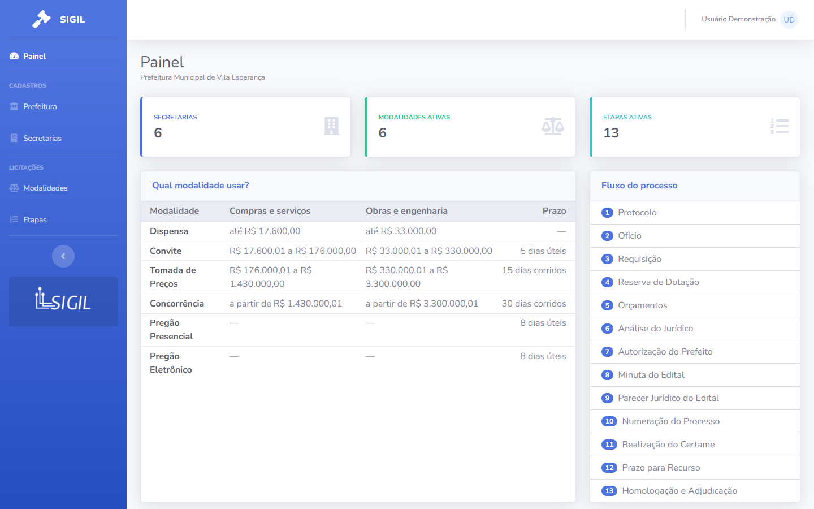
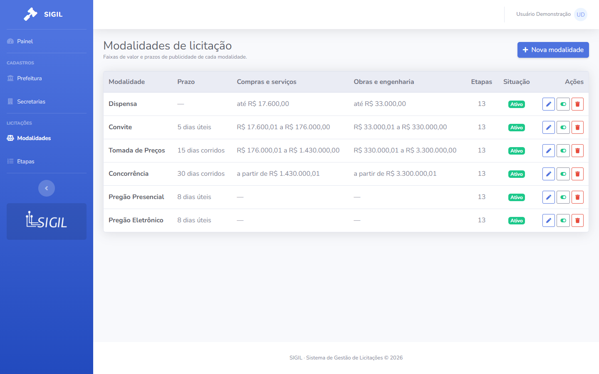
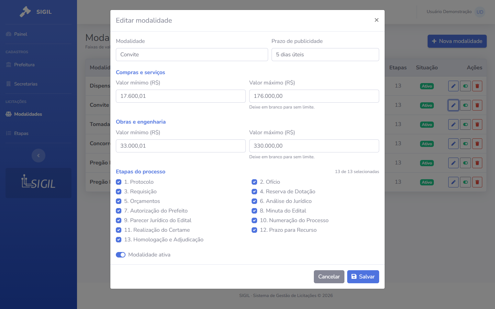
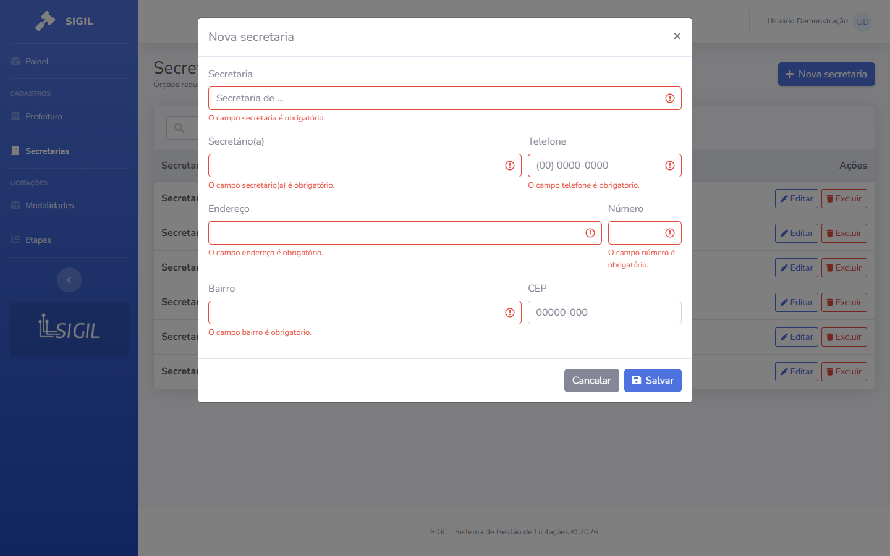

# SIGIL · Public Procurement Management System

A web application that helps Brazilian city halls run their public procurement
processes (*licitações*): the city hall itself, the requesting departments and
their staff, the procurement modes with their value thresholds, the sequence of
steps every process goes through, and the tracking of each process step by step.

> The user interface is in Brazilian Portuguese, as the system targets Brazilian municipalities.



## Live demo

A demo instance is available at **https://sigil.martinisoftware.com.br**, so the application can be evaluated without a local install.

| Email | Password |
|---|---|
| `demo@sigil.test` | `password` |

This is a shared demo environment: data may be changed by other visitors and can be reset at any time. Please don't enter real or sensitive information.

## Features

- **City hall:** one-time setup of the organization. The other modules unlock only after it is configured (`EnsureCityHallIsConfigured` middleware).
- **Departments (*secretarias*):** CRUD with live search reflected in the URL (`?busca=`), pagination and delete confirmation.
- **Staff (*profissionais*):** the people in each department who can be responsible for a step, filterable by department.
- **Procurement modes (*modalidades*):** value ranges for goods/services and for construction/engineering, typed in Brazilian currency format (`1.430.000,00`) and validated (the maximum cannot be lower than the minimum).
- **Process steps (*etapas*):** the procurement workflow shared by every mode, with reordering, enable/disable and filtering by status.
- **Procurement processes (*licitações*):** opening a process (number/year, subject, type, estimated value and mode, with a mode suggestion based on the value ranges) starts it on the first active step. Each step records its start and completion dates, responsible department and staff member, page number and notes. Completing a step requires naming the department and staff member for the next one, which then starts automatically. Any started step can be edited (a step's completion date is also the next step's start date, so they move together), and the last completed step can be reopened to fix mistakes.
- **PDF reports** (dompdf): a process report (filter by status, mode, year and current department, with the total estimated value), a step report (steps active in a period, filter by step, department and staff member, with the average duration of each step) and a per-process sheet with its full step history.
- **Dashboard:** summary counts, a "which mode applies?" table and the process flow with how many processes are currently on each step.
- Input masks for CNPJ (Brazilian company ID), ZIP code, landline/mobile phone and currency, localized validation messages and toast notifications after every action.

| Procurement modes | Editing with currency mask | Validation |
|---|---|---|
|  |  |  |

## Tech stack

| Layer | Technology |
|---|---|
| Backend | PHP 8.2+, Laravel 11 |
| UI | Livewire 3 (full-page components and Form Objects), Alpine.js (input masks) |
| Authentication | Laravel Jetstream (Fortify): login, registration, 2FA, profile |
| Layout | SB Admin 2 (Bootstrap 4) |
| Database | MySQL/MariaDB (tests run on in-memory SQLite) |
| Tests | PHPUnit + `Livewire::test()` |

## Architecture

```
app/
├── Livewire/
│   ├── Dashboard.php
│   ├── CityHalls/Settings.php        # city hall (single-record form)
│   ├── Secretaries/Index.php         # list + create/edit modal
│   ├── Professionals/Index.php
│   ├── BiddingModes/Index.php
│   ├── BiddingSteps/Index.php
│   ├── Biddings/Index.php            # process list + opening a new process
│   ├── Biddings/Show.php             # step-by-step tracking: complete, reopen, edit
│   ├── Forms/                        # Livewire Form Objects: state + validation + persistence
│   └── Concerns/                     # HasFormModal, Notifies (toasts), ChoosesResponsible, SuggestsBiddingMode
├── Models/                           # CityHall, Secretary, Professional, BiddingMode, BiddingStep, Bidding, BiddingStage
├── Enums/BiddingType.php             # goods/services or construction/engineering
├── Http/Middleware/EnsureCityHallIsConfigured.php
└── Support/Money.php                 # BRL ⇄ decimal conversion and range descriptions
resources/views/
├── layouts/admin.blade.php
├── components/sigil/                 # input, select, modal, page-header, status-badge
└── livewire/
lang/pt_BR/                           # validation, auth and Jetstream translations
```

Key design decisions:

- **Form Objects** (`app/Livewire/Forms`) hold validation rules, localized field names and persistence, so components only deal with UI interaction.
- **Steps are resolved lazily.** A process stores only the steps it has already started (`bidding_stages`). The next step is looked up in the step register when the current one is completed: the first active step positioned after the current one that the process hasn't been through yet. Changes to the register (disabling, adding or reordering steps) therefore apply to processes already under way, while their history stays intact. The workflow lives in the `Bidding` model (`begin`, `completeCurrentStage`, `reopenLastStage`, `pendingSteps`).
- **Records in use are protected:** modes, departments and staff referenced by a process can't be deleted (foreign keys with `restrict`, plus a friendly message in the UI). Steps are disabled, never deleted.
- **Monetary values** are stored as `decimal(15,2)`. The UI works with Brazilian-formatted strings, and the conversion is isolated in `App\Support\Money`, which has its own unit tests.
- **Server-driven modal:** the `<x-sigil.modal>` component is rendered by Livewire from `$showModal`, with no dependency on Bootstrap's JavaScript.
- **Reference data in idempotent seeders** (`updateOrCreate`): the 13 default steps and the 6 procurement modes, using the thresholds set by Decree 9.412/2018.

## Getting started

Requirements: PHP 8.2+, Composer, Node 18+ and MySQL/MariaDB.

```bash
git clone <repository-url> sigil && cd sigil
composer install
npm install && npm run build      # assets for the login/profile pages (Jetstream)

cp .env.example .env
php artisan key:generate
# set DB_DATABASE / DB_USERNAME / DB_PASSWORD in .env and create the database

php artisan migrate --seed
php artisan serve
```

Open `http://localhost:8000` and sign in with the demo user, created by `DemoSeeder` when `APP_ENV=local`:

- **Email:** `demo@sigil.test`
- **Password:** `password`

## Tests

```bash
php artisan test
```

The suite runs on in-memory SQLite (configured in `phpunit.xml`), so it never touches the development database. It covers the Livewire components (create, edit, validation, search, reordering, enable/disable and delete), the access middleware, the dashboard and the currency conversion.

## Roadmap

- **Procurement processes** module: opening a process per department, choosing the mode automatically from the estimated value, and tracking each step.
- Compliance with **Law 14.133/2021** (Brazil's new Public Procurement Law), which abolished the *Convite* and *Tomada de Preços* modes and introduced *Diálogo Competitivo*. The current modes follow the previous Law 8.666/93.
